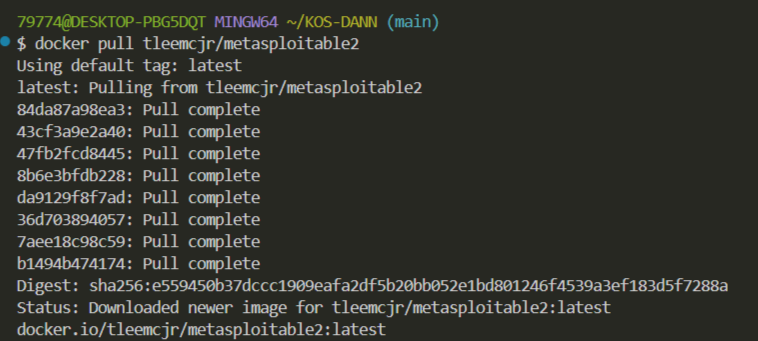
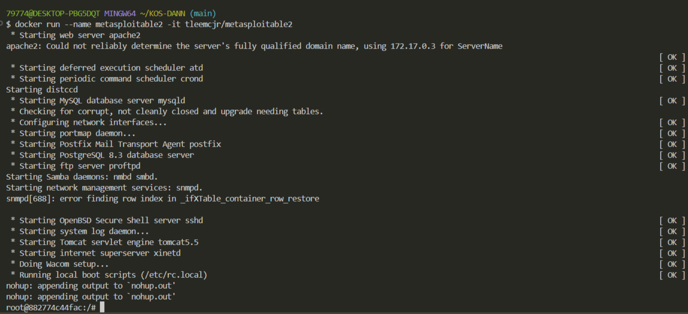
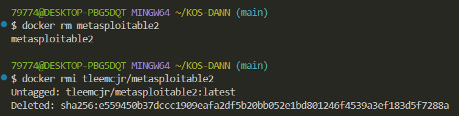

## Metasploitable2 docker

```
Metasploitable2 — специально уязвимая виртуальная машина Linux, созданная проектом Metasploit. Предназначена для использования в качестве среды обучения и тестирования для специалистов и энтузиастов в области безопасности, чтобы практиковать навыки взлома и пентеста.
```

Установить докер-образ

```shell
docker pull tleemcjr/metasploitable2
```


Загрузить образ, создать и запустить контейнер, войти в него (для Windows)
```shell
docker run --name metasploitable2 -it tleemcjr/metasploitable2
```

Загрузить образ, создать и запустить контейнер, войти в него (для Linux)
```shell
docker run --name metasploitable2 -it tleemcjr/metasploitable2:latest sh -c "/bin/services.sh && bash"
```



Остановить контейнер и выйти из него
```shell
exit
```

Удалить контейнер
```shell
docker rm metasploitable2
```

Удалить образ
```shell
docker rmi tleemcjr/metasploitable2
```


[Metasploitable2 на Docker hub](https://hub.docker.com/r/tleemcjr/metasploitable2#!)
