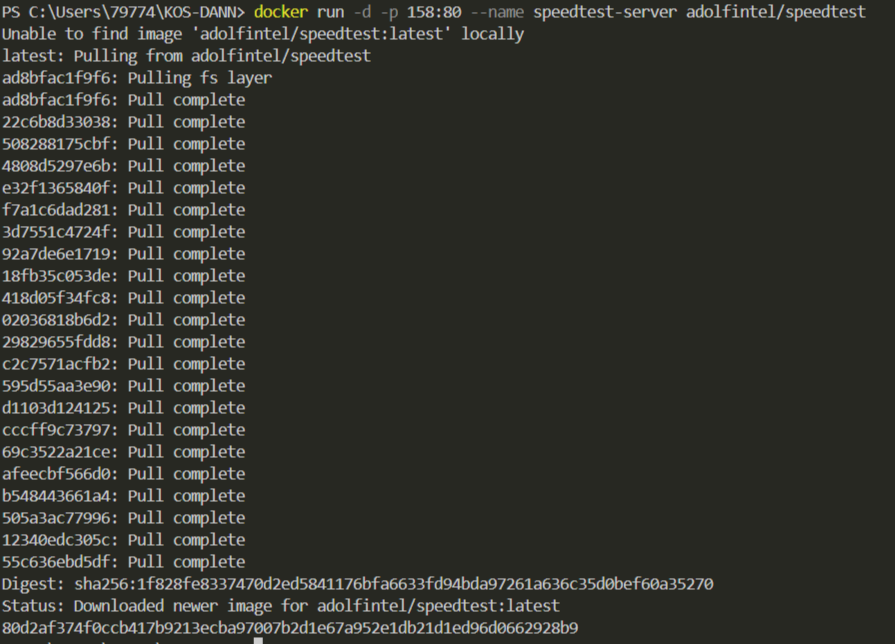
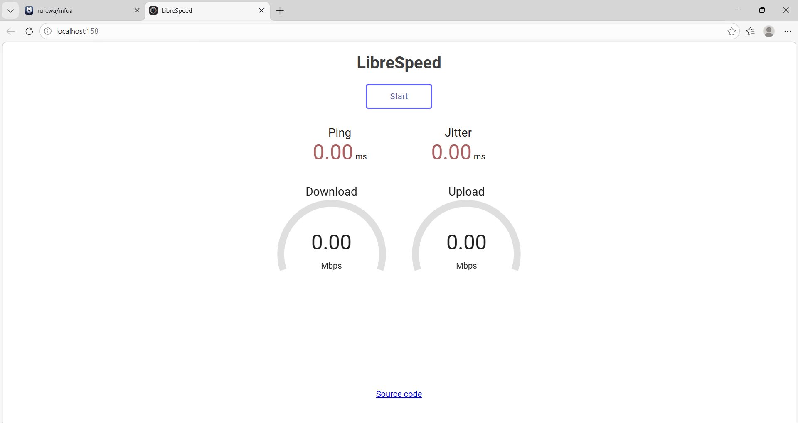
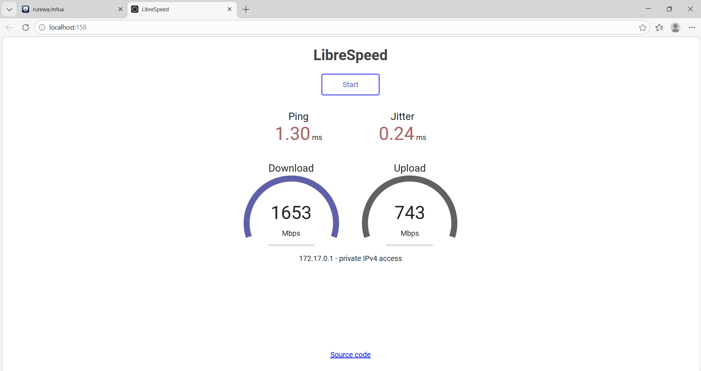

## Тест скорости интернета


1. **Speedtest** в **Docker**
```shell
docker run -d -p 158:80 --name speedtest-server adolfintel/speedtest
```


Установка



Как выглядит

[Открыть в браузере http://localhost:158/](http://localhost:158/)



Результат теста

