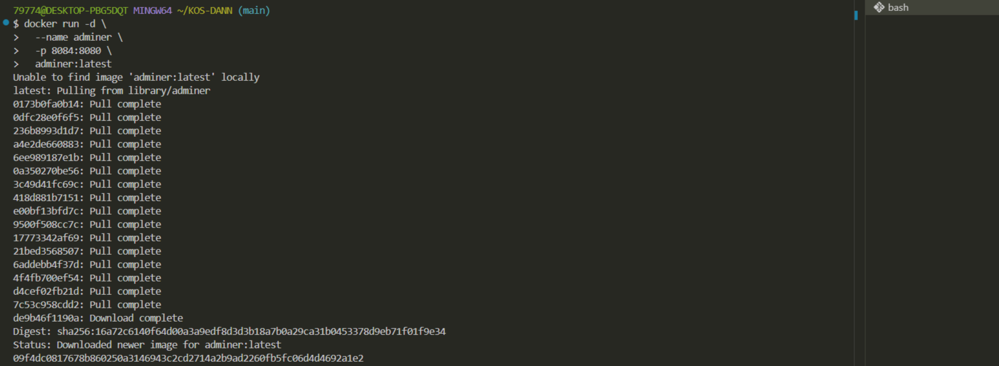
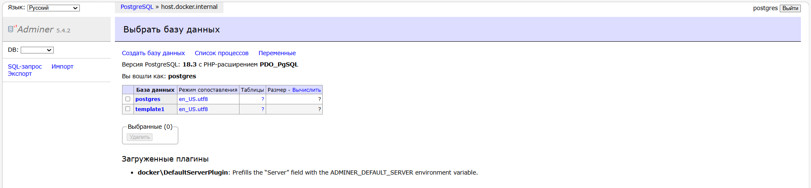

## Adminer (альтернатива phpMyAdmin)

Запуск Adminer для управления БД

Выполните все этапы работы с проектом по примеру с [Nginx](/content/Docker/ImageLibrary/Nginx.md)



Запустите **Adminer** в **Git-Bash/Linux/WSL 2.0/Mac**
```shell
docker run -d \
  --name adminer \
  -p 8084:8080 \
  adminer:latest
```

[Откройте: http://localhost:8084](http://localhost:8084)

> Без отдельно запущенного контейнера с БД PostgreSQL и связи с ним админ-панель работаеть не будет!

> Заполнять данные админ-панели не нужно!



Система:
- PostgreSQL
- сервер: host.docker.internal
- логин: postgres
- пароль: mysecretpassword
