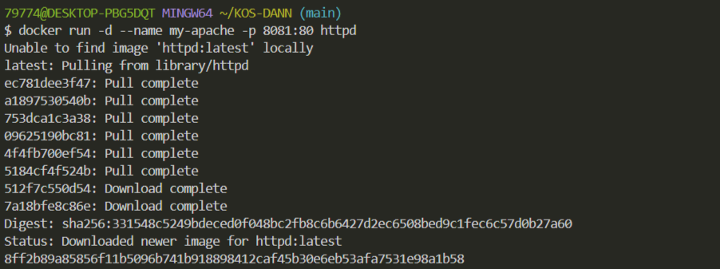
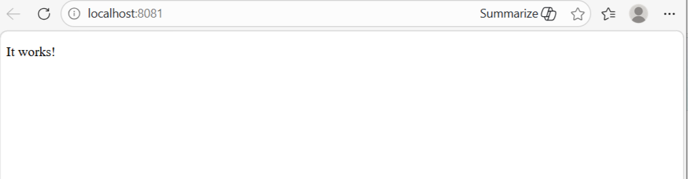
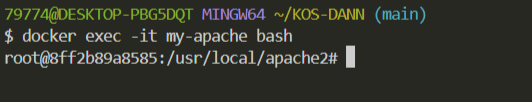
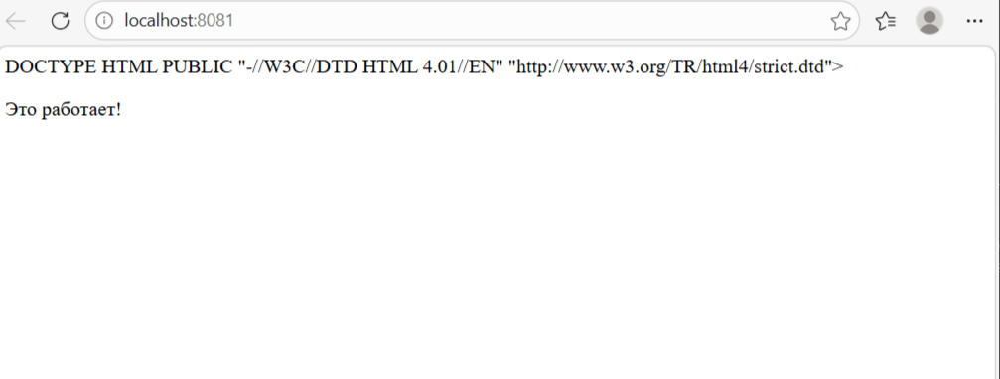

# Лабораторная работа: Apache HTTP Server

## Цель работы
Научиться работать с Docker-образом Apache HTTP Server: получить образ, запустить контейнер, настроить веб-страницу и внести изменения в содержимое сайта.

---

## Ход выполнения

### 1. Получение образа и запуск контейнера

Выполните команду для загрузки образа `httpd` и запуска контейнера с пробросом порта:

```shell
docker run -d --name my-apache -p 8081:80 httpd
```

**Результат выполнения команды:**



---

### 2. Проверка работы веб-сервера

Откройте в браузере адрес: [http://localhost:8081](http://localhost:8081)

**Ожидаемый результат:**  
Должна отобразиться стандартная страница приветствия Apache ("It works!").



---

### 3. Вход в контейнер

Подключитесь к запущенному контейнеру с помощью интерактивной оболочки bash:

```shell
docker exec -it my-apache bash
```



---

### 4. Установка текстового редактора

Внутри контейнера установите текстовый редактор `micro` (обновите пакетную базу и установите):

```shell
apt update && apt install -y micro
```


### 5. Редактирование веб-страницы

Откройте файл `index.html` для редактирования:

```shell
micro /usr/local/apache2/htdocs/index.html
```


**Важно:** Чтобы на странице корректно отображался русский язык, добавьте в `<head>` документа следующий тег:

```html
<meta charset="UTF-8">
```

Отредактируйте содержимое страницы по своему усмотрению.

**Сохранение и выход:**
- Сохранить изменения: `Ctrl + S`
- Выйти из редактора: `Ctrl + Q` (или `F10`)


---

### 6. Проверка изменений

Выйдите из контейнера:

```shell
exit
```

Обновите страницу в браузере по адресу: [http://localhost:8081](http://localhost:8081)

**Ожидаемый результат:**  
Должна отображаться измененная вами веб-страница с поддержкой русского языка.




## Контрольные вопросы

### 1. Для чего используется ключ `-d` в команде `docker run`?

Ключ `-d` (или `--detach`) используется для запуска контейнера в фоновом (detached) режиме. Это означает, что контейнер будет работать в фоне, не блокируя текущее окно терминала. После выполнения команды терминал сразу возвращает управление пользователю, выводя только идентификатор (ID) запущенного контейнера.

**Пример:** 
```shell
docker run -d --name my-apache -p 8081:80 httpd
```
Без ключа `-d` контейнер занял бы текущий терминал, и все логи выводились бы прямо на экран, что неудобно для долго работающих сервисов.

---

### 2. Что означает опция `-p 8081:80`?

Опция `-p` (или `--publish`) используется для проброса портов между хост-машиной и контейнером. Формат: `-p <порт_хоста>:<порт_контейнера>`

В данном случае:
- **`8081`** — порт на вашей локальной машине (хост-системе)
- **`80`** — порт внутри контейнера, на котором слушает веб-сервер Apache

Это позволяет обращаться к веб-серверу, запущенному внутри контейнера, через браузер на хосте по адресу `http://localhost:8081`. Если бы проброс не был настроен, веб-сервер был бы доступен только внутри контейнера.

---

### 3. Почему важно добавлять тег `<meta charset="UTF-8">` при работе с русским языком?

Тег `<meta charset="UTF-8">` указывает браузеру, в какой кодировке отображать веб-страницу. Без этого тега браузер может использовать кодировку по умолчанию (например, Windows-1251 или ISO-8859-1), что приведет к некорректному отображению русских символов — вместо текста будут отображаться "кракозябры" (иероглифы, вопросительные знаки и другие нечитаемые символы).

UTF-8 — это универсальная кодировка, поддерживающая все символы Unicode, включая русский язык, что делает её стандартом для современных веб-страниц.

---

## Вывод

В ходе выполнения лабораторной работы я ознакомился(ась) с основами работы с Docker-образом Apache HTTP Server.

Мне удалось:
1. Загрузить официальный образ `httpd` из Docker Hub.
2. Запустить контейнер с пробросом портов, что позволило получить доступ к веб-серверу из браузера хостовой системы.
3. Подключиться к запущенному контейнеру с помощью команды `docker exec -it`, установить текстовый редактор `micro` и отредактировать файл `index.html`.
4. Добавить поддержку русского языка на веб-страницу с помощью тега `<meta charset="UTF-8">`.
5. Убедиться, что изменения вступили в силу после обновления страницы в браузере.

В процессе работы были закреплены следующие навыки:
- Использование основных команд Docker (`run`, `exec`, `exit`)
- Понимание механизма проброса портов между хостом и контейнером
- Работа с файловой системой внутри контейнера
- Редактирование файлов с помощью консольного редактора
