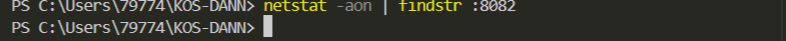
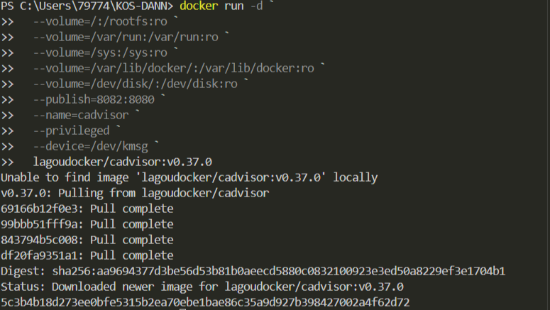
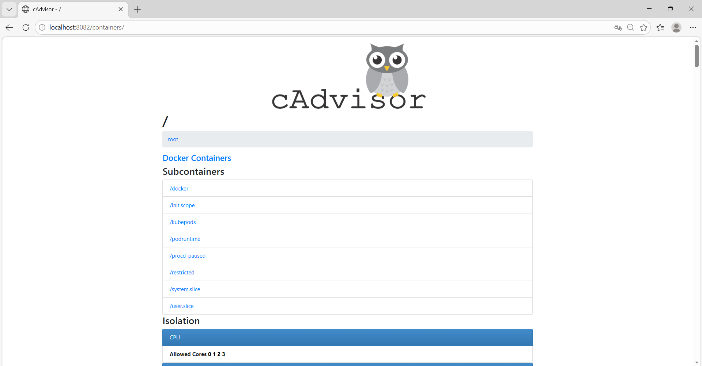
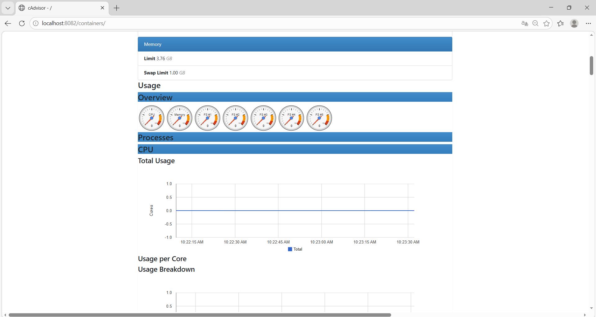

## cAdvisor (мониторинг контейнеров)


1. Мониторинг Docker контейнеров

> Если эта команда ничего не возвращает, то порт свободен

```shell
netstat -aon | findstr :8082
```


Загрузка, создание и запуск контейнера с **cAdvisor** в **Windows  Powershell**:
```shell
docker run -d `
  --volume=/:/rootfs:ro `
  --volume=/var/run:/var/run:ro `
  --volume=/sys:/sys:ro `
  --volume=/var/lib/docker/:/var/lib/docker:ro `
  --volume=/dev/disk/:/dev/disk:ro `
  --publish=8082:8080 `
  --name=cadvisor `
  --privileged `
  --device=/dev/kmsg `
  lagoudocker/cadvisor:v0.37.0
```


> Если эта команда в Powershell не работает, то удалите из кода апострофы 
2. [Откройте: http://localhost:8082](http://localhost:8082)


