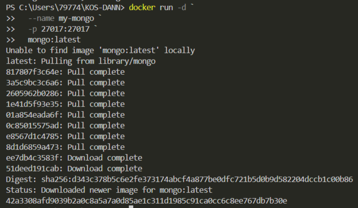
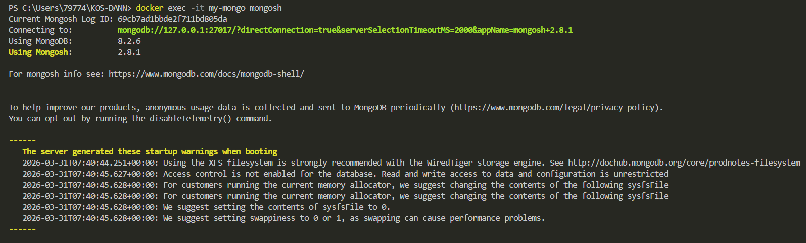
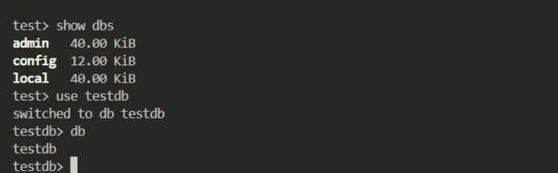

## MongoDB (NoSQL)


1. Запуск **MongoDB**

в **Windows Powershell**
```shell
docker run -d `
  --name my-mongo `
  -p 27017:27017 `
  mongo:latest
```


2. Подключиться через shell
```shell
docker exec -it my-mongo mongosh
```


Некоторые команды для проверки

