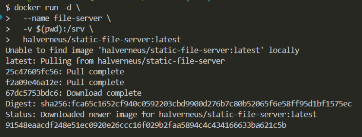
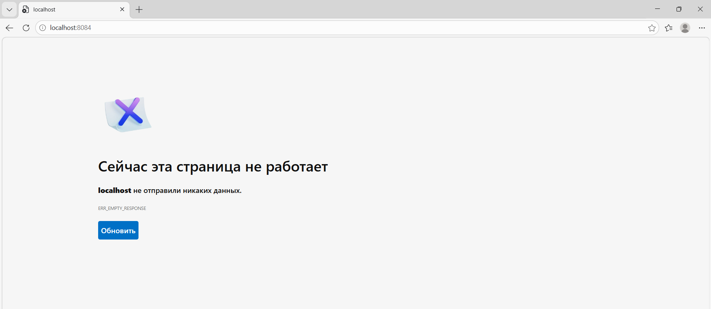

## Файловый обменник


1. Запустить **simple-http-server** для раздачи файлов

в **Windows Powershell**
```shell
docker run -d `
  --name file-server `
  -p 8084:80 `
  -v "${PWD}:/srv" `
  halverneus/static-file-server:latest
```


в **Git-Bash/Linux/WSL 2.0/Mac**
```shell
docker run -d \
  --name file-server \
  -p 8084:80 \
  -v $(pwd):/srv \
  halverneus/static-file-server:latest
```
2. [Откройте: http://localhost:8084](http://localhost:8084)

