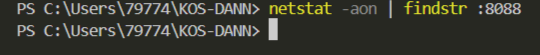
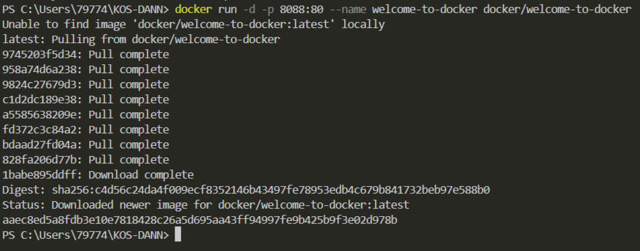
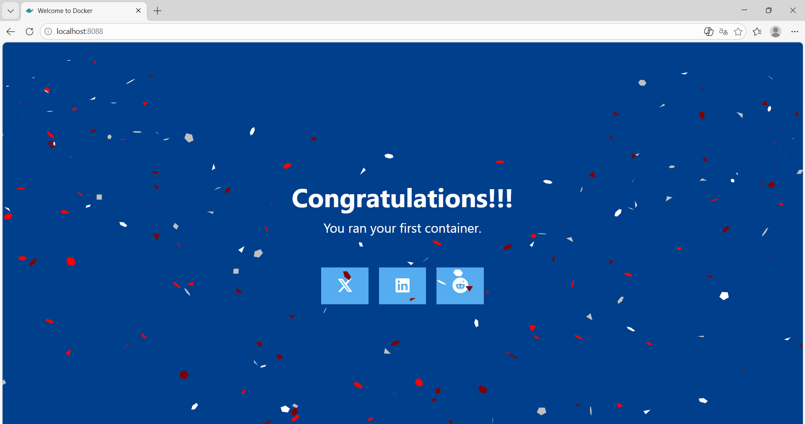
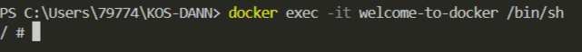
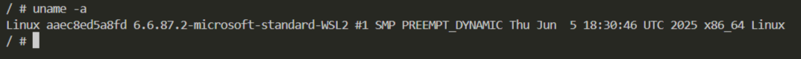
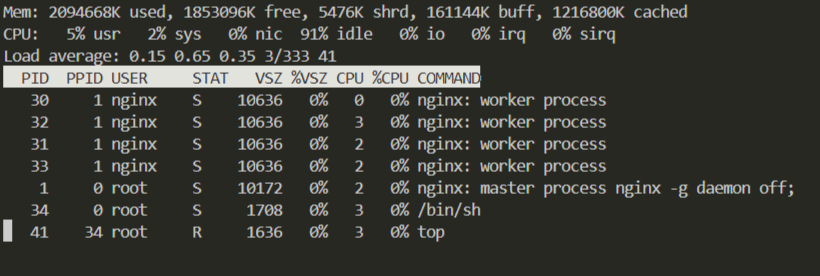
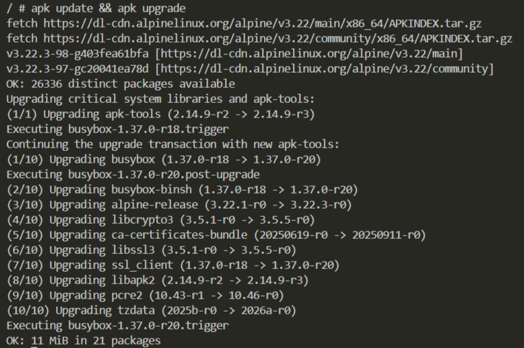
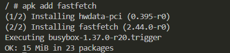
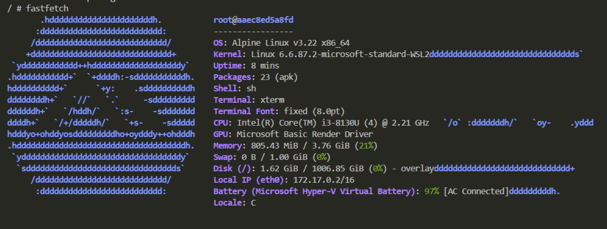

# Добро пожаловать в Docker 🐳

## 🔍 Проверка порта 8088

```bash
netstat -aon | findstr :8088
```



---

## 🚀 Запуск контейнера

```bash
docker run -d -p 8088:80 --name welcome-to-docker docker/welcome-to-docker
```



---

## 🌐 Страница в браузере

[http://localhost:8088](http://localhost:8088)



---

## 🐚 Вход в контейнер

```bash
docker exec -it welcome-to-docker /bin/sh
```



---

## 💻 Информация об ОС

```bash
uname -a
```



---

## 📊 Диспетчер ресурсов (top)

```bash
top
```



---

## 🔄 Обновление пакетов

```bash
apk update && apk upgrade
```



---

## 📦 Установка fastfetch

```bash
apk add fastfetch
```



---

## ✨ Запуск fastfetch

```bash
fastfetch
```



---
