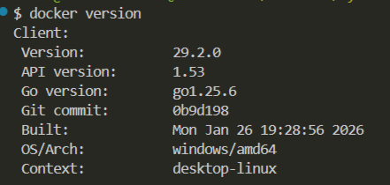
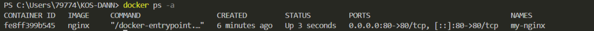
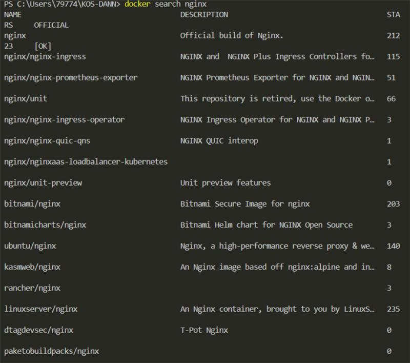
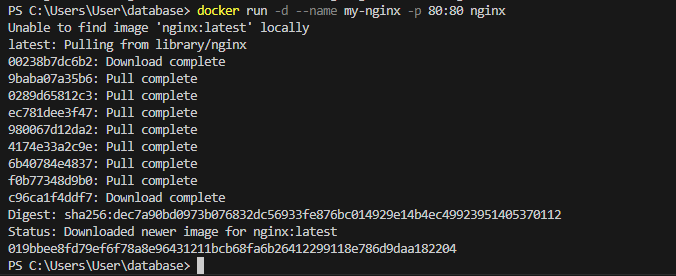
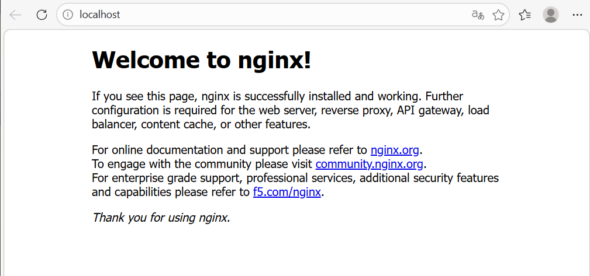

## Практическая работа на примере готового образа Nginx в Docker

> **Nginx** - это легкий и небольшой веб-сервер

## Этапы

### 1. Проверить Docker

Получить версию установленного у вас Docker
```shell
docker version
```


> Готовые образы берутся из сторонних источников: **Docker Hub** или другие

[Ссылка на Docker Hub](https://hub.docker.com/)

### 2. Подготовка Docker (чтобы начать работать с "чистого листа")

1. Остановить все запущенные контейнеры
1. Удалить все остановленные контейнеры
1. Удалить все неиспользуемые образы

- Следует убедиться, нет ли у вас уже установленных и запущенных контейнеров:
```shell
docker ps -a
```
- Если есть, то лучше их остановить:
```shell
docker stop $(docker ps -q)
```
- Если остановленные контейнеры не нужно, то удалить их:
```shell
docker container prune
```
или
```shell
docker container prune $(docker ps -q)
```
- Ещё раз убедиться, что нет лишних контейнеров:
```shell
docker ps -a
```



- Опционально можно удалить ненужные образы. Показать текущие образы:
```shell
docker images
```
Удалить все ненужные образы
```shell
docker image prune -a
```
или
```shell
docker rmi $(docker images -q)
```

> Удалять нужно только учебные контейнеры и образы, т.к. есть риск потерять важные данные, которые могут содержаться в контейнерах!

### 3. Получение готового образа Nginx

1. Поиск и получение готового образа на Docker Hub
1. Создание и запуск контейнера из полученного образа
1. Проверка состояния приложения из Docker-контейнера
1. Управление контейнером

Найти нужный образ на **Docker Hub**
```shell
docker search nginx
```



Так же готовый образ можно искать в **Docker Desktop**

Получить, создать и запустить Nginx
```shell
docker run -d --name my-nginx -p 80:80 nginx
```

`docker run` объединяет команды `docker pull`, `docker create` и `docker start`

Если запуск контейнера не удался, то проверьте уже созданные контейнеры с таким именем у себя
```shell
docker ps -a
```



Показать загруженный на ваш компьютер образ
```shell
docker images
```

Показать работающий Nginx

Способ 1
```shell
curl http://localhost/
```

Способ 2 - [открыть http://localhost/ адрес в браузере](http://localhost/)



Опционально, если нужно только получить готовый образ, без создания и запуска контейнера, то
```shell
docker pull nginx
```

Получить информацию по загруженному образу:
```shell
docker inspect nginx
```

При необходимости остановить контейнер с таким именем:
```shell
docker stop my-nginx
```

Проверьте остановленное приложение в браузере по тому же адресу, обновив страницу по `Ctrl+R` или `F5`

Перезапустить контейнер по имени
```shell
docker restart my-nginx
```
Перезапустить контейнер по его **id**
```shell
docker restart 2e6c42d9b6af
```
Перед удалением нужно остановить указанный контейнер
```shell
docker stop my-nginx
```

Опционально можно удалить выбранный контейнер по его имени
```shell
docker rm my-nginx
```
