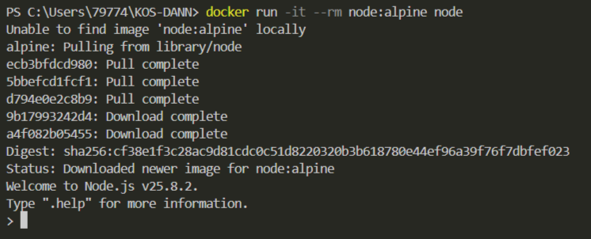
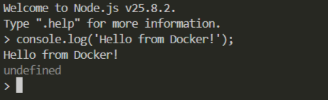

## Node.js для JavaScript


Запустить **Node.js REPL**
```shell
docker run -it --rm node:alpine node
```


И запустить скрипт
```shell
console.log('Hello from Docker!');
```


Для выхода из консоли
```shell
.exit
```
