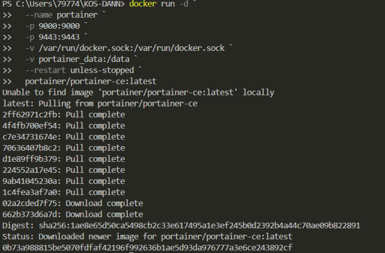
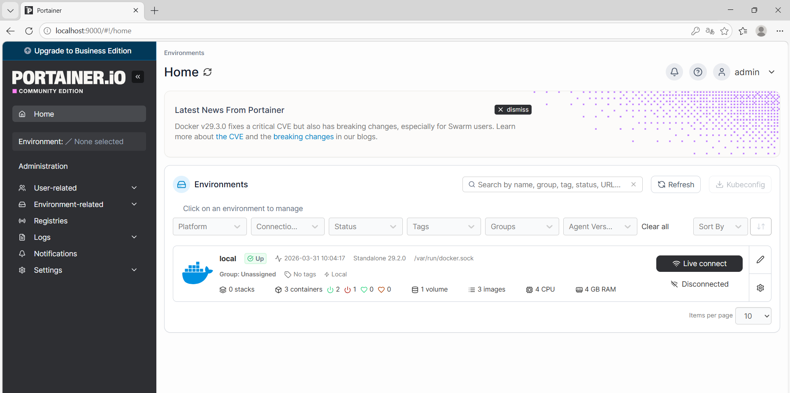
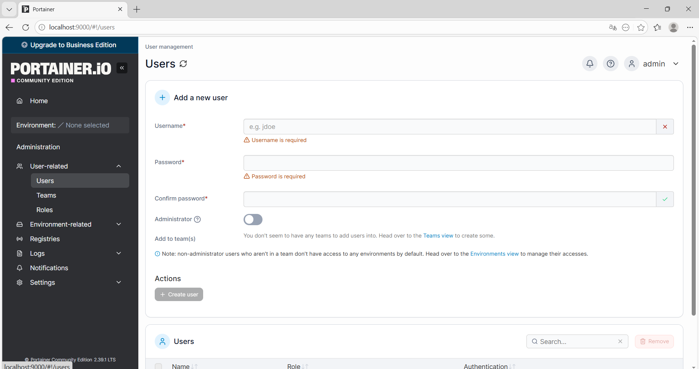
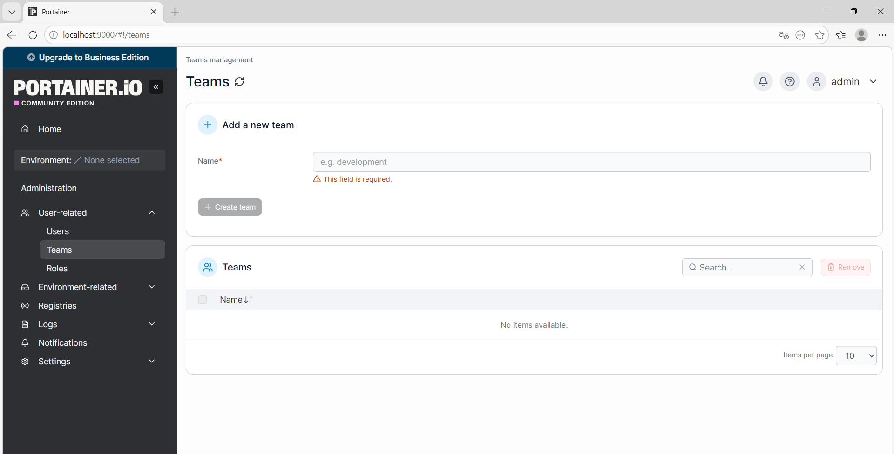
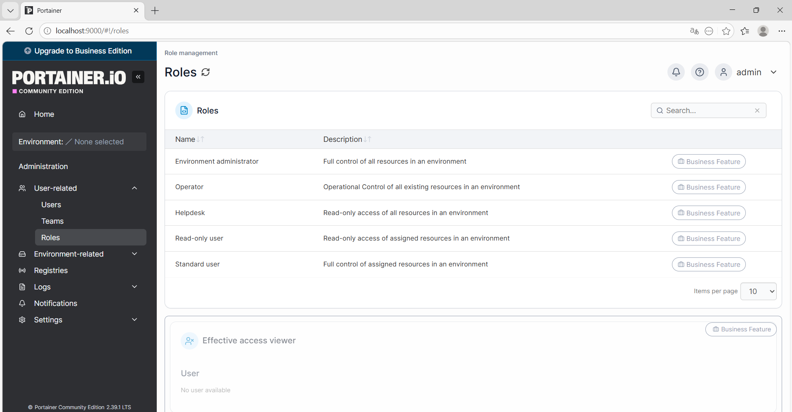
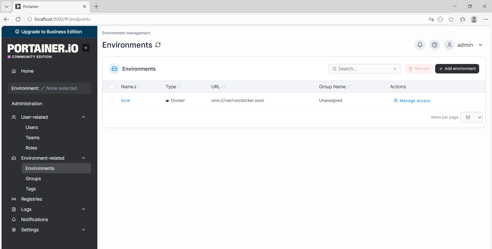

## Portainer

Выполните все этапы работы с проектом по примеру с [Nginx](/content/Docker/ImageLibrary/Nginx.md)

### Вариант с томами (с сохранением данных)

в **Windows Powershell**
```shell
docker run -d `
  --name portainer `
  -p 9000:9000 `
  -p 9443:9443 `
  -v /var/run/docker.sock:/var/run/docker.sock `
  -v portainer_data:/data `
  --restart unless-stopped `
  portainer/portainer-ce:latest
```



[Подключиться через браузер по http://localhost:9000/](http://localhost:9000/)


на следующих скриншотах представлены возможности Portainer







