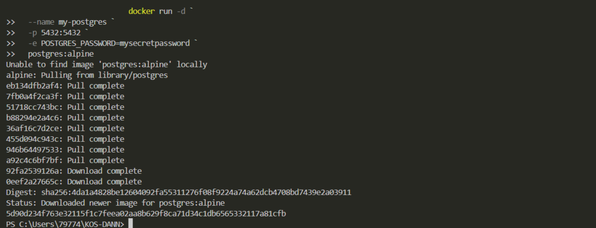
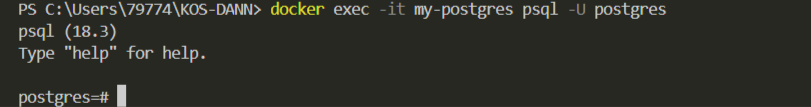
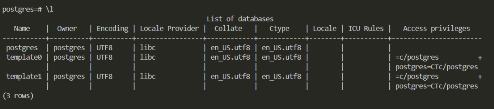
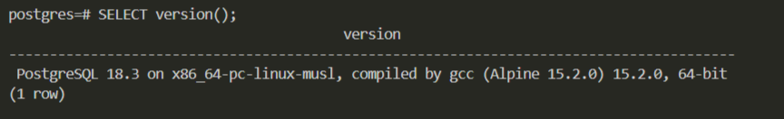

## PostgreSQL


Запуск **PostgreSQL** с паролем

в **Windows Powershell**
```shell
docker run -d `
  --name my-postgres `
  -p 5432:5432 `
  -e POSTGRES_PASSWORD=mysecretpassword `
  postgres:alpine
```


Подключиться через `psql`
```shell
docker exec -it my-postgres psql -U postgres
```


Получить список баз данных:
```sql
\l
```



Получить версию:
```sql
SELECT version();
```


выйти из БД
```sql
exit
```
