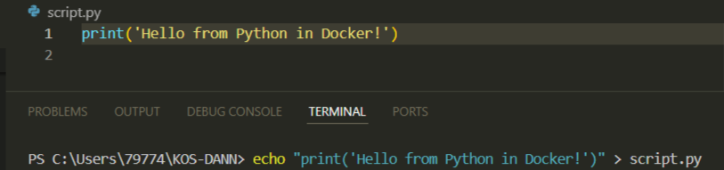
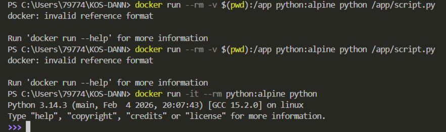
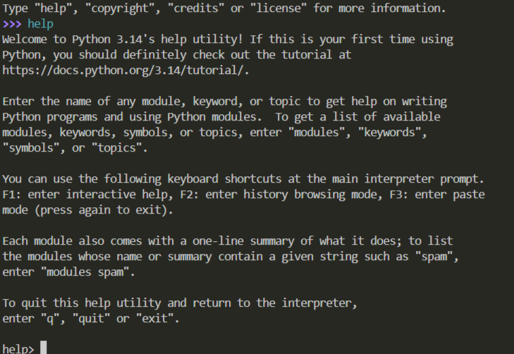

## Python для запуска скриптов


1. Создайте **Python** скрипт
```shell
echo "print('Hello from Python in Docker!')" > script.py
```


2. Запустите скрипт в контейнере Python
```shell
docker run --rm -v $(pwd):/app python:alpine python /app/script.py
```


3. Интерактивный **Python**
```shell
docker run -it --rm python:alpine python
```

