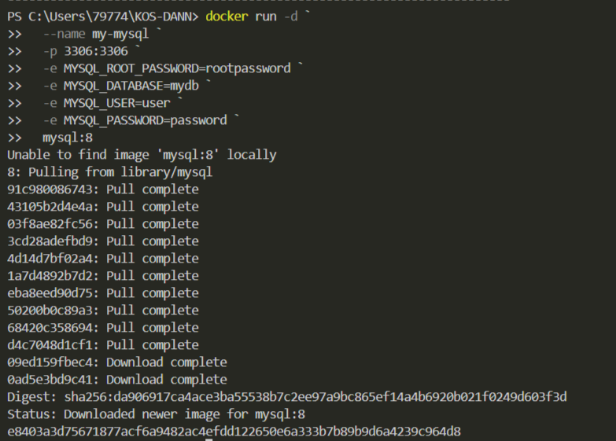
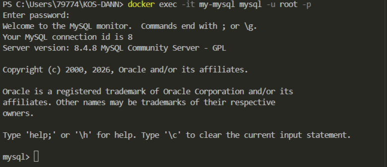
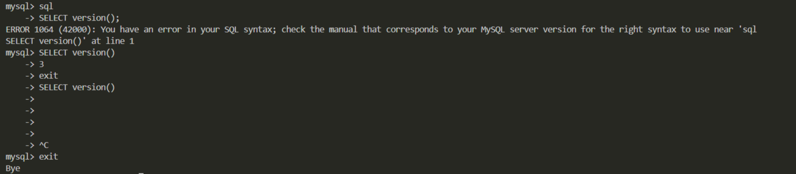

## MySQL база данных


1. Запуск **MySQL**

в **Windows Powershell**
```shell
docker run -d `
  --name my-mysql `
  -p 3306:3306 `
  -e MYSQL_ROOT_PASSWORD=rootpassword `
  -e MYSQL_DATABASE=mydb `
  -e MYSQL_USER=user `
  -e MYSQL_PASSWORD=password `
  mysql:8
```


2. Подключиться
```shell
docker exec -it my-mysql mysql -u root -p
```
> Пароль: rootpassword



Повыполняйте какие-нибудь команды SQL для проверки и пришлите скрины.

Получить список баз данных:
```sql
sql
```
Получить версию:
```sql
SELECT version();
```
выйти из БД
```sql
exit
```

