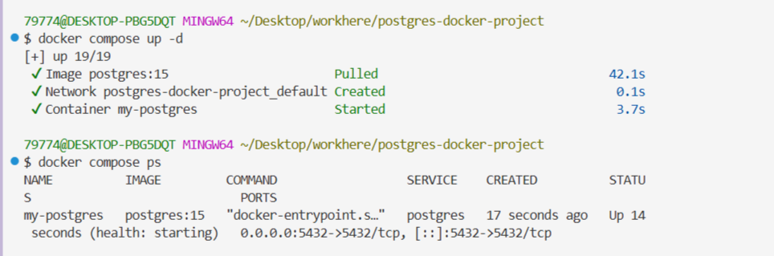
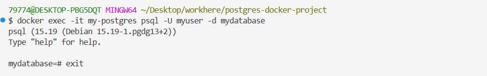

# Задание: Развёртывание PostgreSQL в Docker Compose

## Цель работы

Изучить принципы работы **Docker Compose** на примере развёртывания контейнера с **PostgreSQL**. Освоить монтирование томов, инициализацию базы данных SQL-скриптами, настройку `healthcheck`, управление жизненным циклом контейнеров и работу с образами.

## Теоретическая справка

**PostgreSQL** (часто — Postgres) — свободная объектно-реляционная система управления базами данных (ORDBMS) с открытым исходным кодом.

**Docker Compose** — инструмент для определения и запуска многоконтейнерных Docker-приложений с помощью файла `docker-compose.yml`.

## Ход выполнения работы

### 1. Подготовка рабочего окружения

Перед началом работы проверьте запущенные **docker-compose** приложения:

```shell
docker compose ls
```

Остановите лишние приложения, чтобы избежать конфликтов использования портов.

Ожидаемая структура проекта:

```
postgres-docker-project/
├── data/                # Для хранения данных БД (volume)
├── scripts/             # SQL скрипты для инициализации
├── backups/             # Для бэкапов БД
└── docker-compose.yml   # Главный конфиг
```

Создайте всю структуру проекта одной **bash**-командой:

```shell
mkdir -p postgres-docker-project/{data,scripts,backups} && \
touch postgres-docker-project/docker-compose.yml postgres-docker-project/scripts/init.sql && \
cd postgres-docker-project
```

### 2. Создание файла конфигурации `docker-compose.yml`

Заполните файл `docker-compose.yml` следующим содержимым:

```yml
services:
  postgres:
    image: postgres:15
    container_name: my-postgres
    environment:
      POSTGRES_DB: mydatabase
      POSTGRES_USER: myuser
      POSTGRES_PASSWORD: mypassword
    ports:
      - "5432:5432"
    volumes:
      - ./data:/var/lib/postgresql/data
      - ./scripts/init.sql:/docker-entrypoint-initdb.d/init.sql
      - ./backups:/backups
    restart: unless-stopped
    healthcheck:
      test: ["CMD-SHELL", "pg_isready -U myuser -d mydatabase"]
      interval: 30s
      timeout: 10s
      retries: 3
```

Разбор ключевых директив:

| Директива | Назначение |
|-----------|-----------|
| `image: postgres:15` | Используемый образ PostgreSQL версии 15 |
| `container_name: my-postgres` | Имя контейнера в Docker (видно в `docker ps`) |
| `environment:` | Переменные для создания БД, пользователя и пароля |
| `ports: "5432:5432"` | Порт хоста → порт контейнера (доступ с `localhost:5432`) |
| `volumes:` | Монтирование `./data`, `init.sql` и `./backups` |
| `restart: unless-stopped` | Перезапуск всегда, кроме ручной остановки |
| `healthcheck:` | Автопроверка готовности PostgreSQL через `pg_isready` |

### 3. Создание файла инициализации `scripts/init.sql`

Заполните файл `scripts/init.sql` следующим содержимым:

```sql
-- Создаем дополнительную базу данных
CREATE DATABASE app_db;

-- Создаем дополнительного пользователя
CREATE USER app_user WITH PASSWORD 'app_password';

-- Даем права
GRANT ALL PRIVILEGES ON DATABASE app_db TO app_user;

-- Создаем тестовую таблицу
\c mydatabase;

CREATE TABLE IF NOT EXISTS users (
    id SERIAL PRIMARY KEY,
    name VARCHAR(100) NOT NULL,
    email VARCHAR(100) UNIQUE NOT NULL,
    created_at TIMESTAMP DEFAULT CURRENT_TIMESTAMP
);

-- Вставляем тестовые данные
INSERT INTO users (name, email) VALUES
('Иван Иванов', 'ivan@example.com'),
('Мария Петрова', 'maria@example.com')
ON CONFLICT (email) DO NOTHING;
```

PostgreSQL автоматически выполнит скрипт из папки `/docker-entrypoint-initdb.d/` **при первом запуске** базы данных (когда папка `./data` пуста).

### 4. Запуск и управление PostgreSQL в Docker

Находясь в каталоге проекта, запустите контейнер:

```shell
docker compose up -d
```



Параметр `-d` отвечает за запуск контейнера в фоновом режиме.

Если запустить контейнер без `-d` (интерактивный режим), остановить его можно по **Ctrl+C** в терминале.

Проверьте состояние контейнера (показать, что запущено именно этим compose-проектом):

```shell
docker compose ps
```

Прочитайте логи запущенного контейнера с PostgreSQL:

```shell
docker compose logs postgres
```

Остановите контейнер (ОСТАНОВКА + УДАЛЕНИЕ контейнеров):

```shell
docker compose down
```

Данные БД **не удалятся** при остановке и удалении контейнера! Они хранятся в папке `./data`.

Или используйте `docker compose stop`, если нужно, чтобы контейнер не удалялся:

```shell
docker compose stop
```

Если выполнена остановка контейнера через `stop`, запустить его снова можно командой:

```shell
docker compose start
```

Снова проверьте состояние запущенных контейнеров:

```shell
docker ps -a
```

Показать конфигурацию текущего проекта:

```shell
docker compose config
```

Для каждого нового Docker-контейнера лучше создавать отдельную папку, чтобы каждый проект был в своей папке. Это обеспечит наилучшую изоляцию проектов.

### 5. Управление БД в Docker-контейнере

Подключение к БД:

```shell
docker exec -it my-postgres psql -U myuser -d mydatabase
```

Чтобы выйти из подключённой БД, надо в командной строке БД выполнить `EXIT`.



Попробуйте подключиться к БД с браузера:

```
localhost:5432
```


Пустая страница «Соединение с сайтом localhost было успешно установлено, но он не отправил ничего в ответ» — это нормально, PostgreSQL не является HTTP-сервером.

Проверьте тестовые данные в БД (выполните внутри `psql`):

Остановите на время:

```shell
docker compose stop
```

Запустите обратно:

```shell
docker compose start
```

или

```shell
docker compose up -d
```

### 6. Удаление установленного контейнера с PostgreSQL

Перейдите в папку с проектом:

```shell
cd ~/Docker/postgres-docker-project
```

Остановите и удалите контейнеры, сети:

```shell
docker compose down
```

Или с удалением volumes (данных БД):

```shell
docker compose down -v
```

Ключ `-v` удаляет БД (**все данные будут потеряны**). При удалении контейнера образ сохраняется.

Проверьте, что контейнеров нет:

```shell
docker ps -a
```

Проверьте, что volumes удалены:

```shell
docker volume ls
```

Проверьте, что нет сетей удаляемого образа:

```shell
docker network ls
```

Если `docker network ls` показывает сеть вашего docker compose, даже если он был удалён, просто выполните `docker compose down`.

Должны быть пустые списки или только системные элементы:

| Команда | Ожидаемый результат |
|---------|---------------------|
| `docker ps -a` | Не должно быть `my-postgres` |
| `docker volume ls` | Не должно быть postgres volumes |
| `docker images` | Образ `postgres` есть и его можно оставить (переиспользовать) |

Дальнейшие действия зависят от вашего желания:

**Вариант 1:** Использовать ту же конфигурацию

```shell
docker compose up -d
```

**Вариант 2:** Создать новый проект с улучшениями

```shell
mkdir new-postgres-project
cd new-postgres-project
```

Создать в нём новый `docker-compose.yml` с учётом полученного опыта.

### 7. Удаление образов (опционально)

Посмотреть все образы:

```shell
docker images
```

Проверить, какие контейнеры используются:

```shell
docker ps -a
```

Сначала удалите неиспользуемые и остановленные контейнеры (по **id**-контейнера). Только после этого можно удалять образы.

Удалить образ PostgreSQL:

```shell
docker rmi postgres:15
```

Или удалить все неиспользуемые образы:

```shell
docker image prune -a
```

Проверить результат удаления всех образов:

```shell
docker images
```

Теперь можно запустить проект снова, с «чистого листа». Загрузить и установить новый образ PostgreSQL из папки `postgres-docker-project`:

```shell
docker compose up -d
```