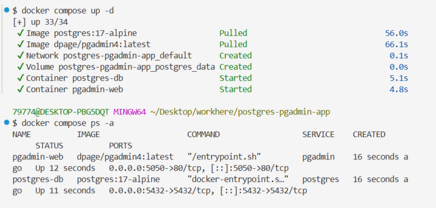
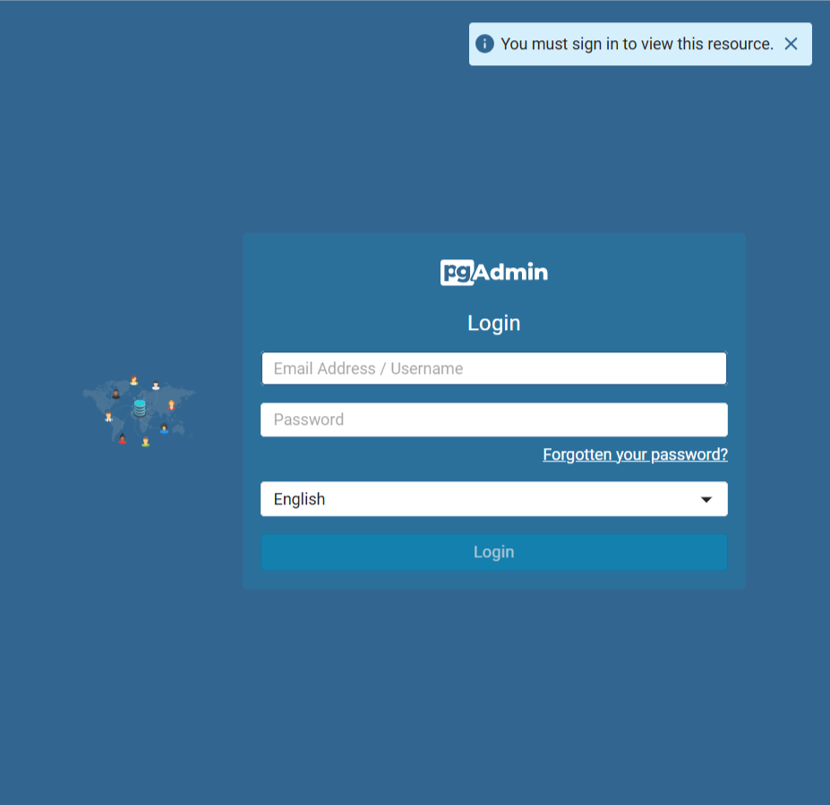
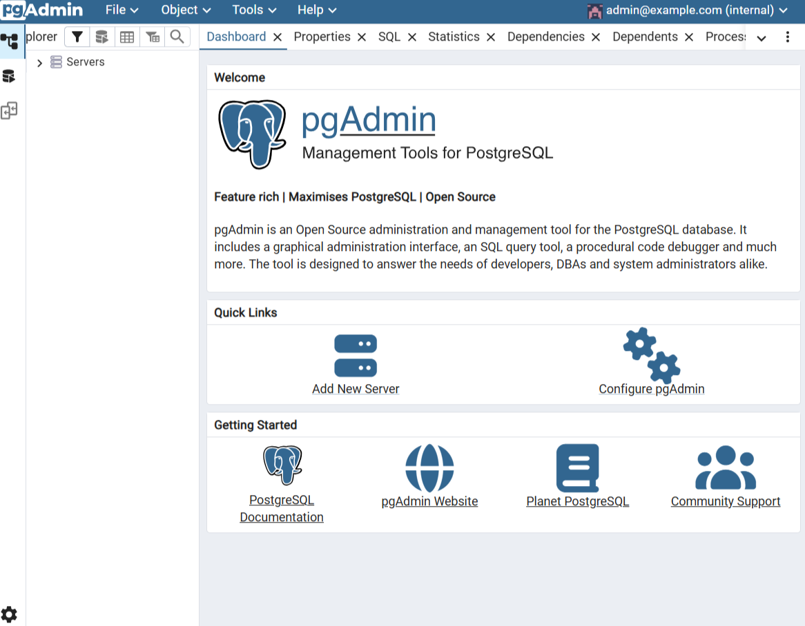
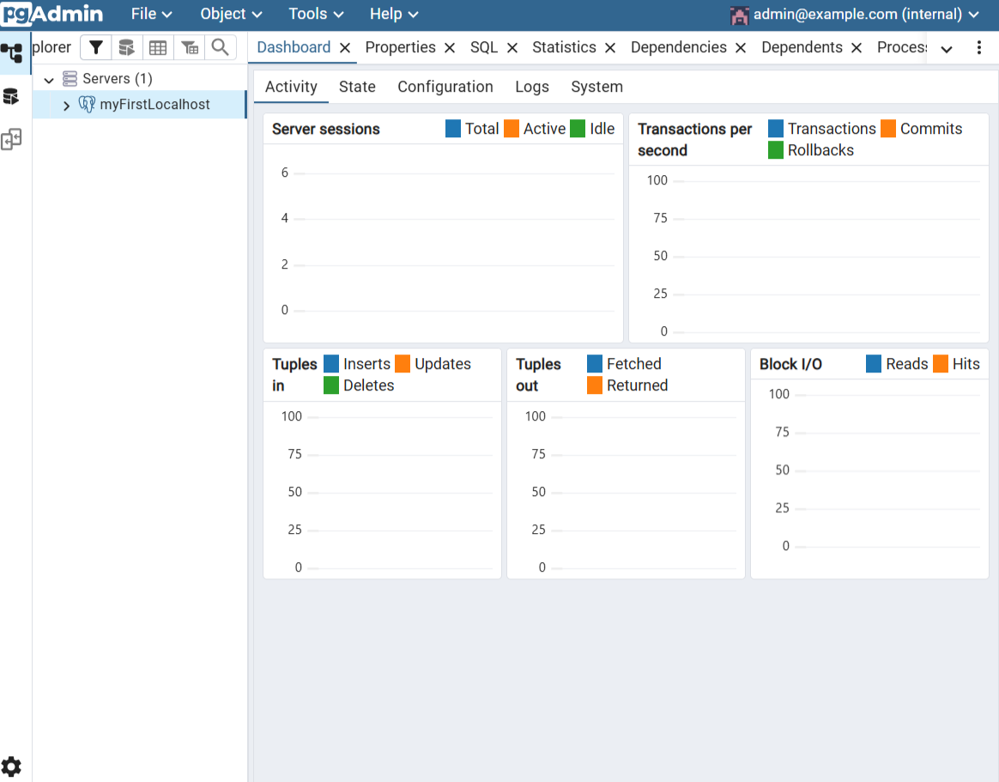

# Задание: Развёртывание MySQL + phpMyAdmin в Docker Compose

## Цель работы

Изучить принципы работы **Docker Compose** на примере развёртывания связки **MySQL** + **phpMyAdmin**. Освоить настройку нескольких взаимодействующих сервисов, работу с сетями и томами, администрирование базы данных через веб-интерфейс.

## Теоретическая справка

**phpMyAdmin** — веб-приложение с открытым исходным кодом на **PHP** для администрирования **MySQL/MariaDB** через браузер. Предоставляет графический интерфейс для управления базами данных без необходимости писать **SQL**-команды вручную.

**Docker Compose** — инструмент для определения и запуска многоконтейнерных Docker-приложений с помощью файла `compose.yaml`.

## Ход выполнения работы

### 1. Создание каталога проекта

Перед началом работы проверьте запущенные **docker-compose** приложения:

```shell
docker compose ls
```

Остановите лишние приложения, чтобы снизить риск возникновения конфликтов использования портов.

Ожидаемая структура проекта:

```
mysql-pma-app/
└── compose.yaml
```

Создайте структуру проекта одной **bash**-командой:

```shell
mkdir -p mysql-pma-app && touch mysql-pma-app/compose.yaml && cd mysql-pma-app
```

### 2. Файл настроек композера `compose.yaml`

Заполните файл `compose.yaml` следующим содержимым:

```yml
services:
  # Сервис базы данных MySQL
  mysql:
    # Используем официальный образ MySQL 8.0
    image: mysql:8.0
    # Контейнер будет автоматически перезапускаться, если он остановился или упал
    restart: unless-stopped
    environment:
      # Обязательные переменные окружения для MySQL
      MYSQL_ROOT_PASSWORD: root       # Пароль для root-пользователя
      MYSQL_DATABASE: my_database     # Имя базы данных, которая будет создана автоматически
      MYSQL_USER: my_user             # Имя дополнительного пользователя
      MYSQL_PASSWORD: my_password     # Пароль для дополнительного пользователя
    ports:
      # Пробрасываем порт 3306 хоста на порт 3306 в контейнере
      - "3306:3306"
    volumes:
      # Сохраняем данные базы данных в Docker-томе для персистентности
      - mysql_data:/var/lib/mysql
    networks:
      - mysql-pma-network

  # Сервис phpMyAdmin
  phpmyadmin:
    # Зависит от сервиса mysql, запустится после его готовности
    depends_on:
      - mysql
    # Используем официальный образ phpMyAdmin
    image: phpmyadmin/phpmyadmin:latest
    # Пробрасываем порт 8083 на хосте на порт 80 в контейнере
    ports:
      - "8083:80"
    restart: unless-stopped
    environment:
      # Переменные для подключения к серверу базы данных
      PMA_HOST: mysql        # Имя хоста MySQL-сервера (совпадает с именем сервиса)
      PMA_PORT: 3306         # Порт MySQL-сервера
      PMA_ARBITRARY: 1       # Разрешает подключаться к произвольному серверу, не только к mysql (полезно для отладки)
      UPLOAD_LIMIT: 300M     # Увеличивает лимит на загрузку файлов (для больших SQL-дампов)
    networks:
      - mysql-pma-network

# Определяем общую сеть для связи контейнеров
networks:
  mysql-pma-network:

# Определяем Docker-том для хранения данных базы данных
volumes:
  mysql_data:
```

Разбор ключевых директив:

| Директива | Назначение |
|-----------|-----------|
| `image: mysql:8.0` | Официальный образ MySQL версии 8.0 |
| `image: phpmyadmin/phpmyadmin:latest` | Официальный образ phpMyAdmin |
| `depends_on:` | phpMyAdmin запускается после MySQL |
| `environment:` | Настройки БД для MySQL и параметры подключения для phpMyAdmin |
| `ports: "3306:3306"` | Доступ к MySQL с хоста через `localhost:3306` |
| `ports: "8083:80"` | Доступ к phpMyAdmin через `http://localhost:8083` |
| `volumes: mysql_data` | Том для сохранения данных БД |
| `networks: mysql-pma-network` | Общая сеть для связи контейнеров |

### 3. Установка и запуск проекта

В папке, где находится ваш `compose.yaml` файл, выполните команду для запуска всех сервисов в фоновом режиме:

```shell
docker compose up -d
```


**Docker** начнёт скачивать необходимые образы и запускать контейнеры. Этот шаг может занять несколько минут.

Параметр `-d` означает фоновый режим запуска контейнеров.

Дождитесь полной загрузки. Убедиться, что всё работает, можно командой:

```shell
docker compose ps -a
```

Оба контейнера (`mysql` и `phpmyadmin`) должны иметь статус **Up**.

### 4. Доступ к локальному сервису phpMyAdmin

- phpMyAdmin: [http://localhost:8083](http://localhost:8083)
- Сервер: `mysql` (или `localhost:3306`)
- Пользователь: `root`
- Пароль: `root`







### 5. Управление и полезные команды

Находясь в папке `mysql-pma-app`:

1. Просмотр логов приложения **phpmyadmin** в реальном времени:

```shell
docker compose logs -f phpmyadmin
```

`-f` в режиме ожидания (в режиме реального времени).

Чтобы выйти из режима просмотра логов, необходимо выполнить `Ctrl+C` в терминале.

2. Просмотр логов базы данных **mysql** в реальном времени:

```shell
docker compose logs -f mysql
```

Чтобы выйти из режима просмотра логов, необходимо выполнить `Ctrl+C` в терминале.

3. Приостановить запущенный контейнер:

```shell
docker compose stop
```

4. Запустить приостановленный контейнер:

```shell
docker compose start
```

5. Перезапустить:

```shell
docker compose restart
```

6. Показать конфигурацию текущего проекта:

```shell
docker compose config
```

7. Вход в контейнер **MySQL** (имя контейнера можно узнать командой `docker compose ps`):

```shell
docker compose exec mysql bash
```

Выйти из контейнера можно командой `exit`.

### 6. Удаление этого проекта

Находясь в папке `mysql-pma-app`:

1. Остановка контейнеров этого проекта:

```shell
docker compose down
```

2. Остановка с полным удалением всех данных (базы данных и файлов) — опционально:

```shell
docker compose down --volumes
```

или для краткости:

```shell
docker compose down -v
```

**Будьте осторожны:** эта команда удалит всё, что вы создали в проекте!

Для полного удаления этого проекта достаточно остановить его через `docker compose down` или `docker compose down --volumes`, удалить docker-образ, после чего удалить каталог проекта `mysql-pma-app`.

Удалить образ проекта:

```shell
docker image rm
```

Выходим из каталога проекта:

```shell
cd ..
```

и удаляем:

```shell
rm -rf mysql-pma-app
```