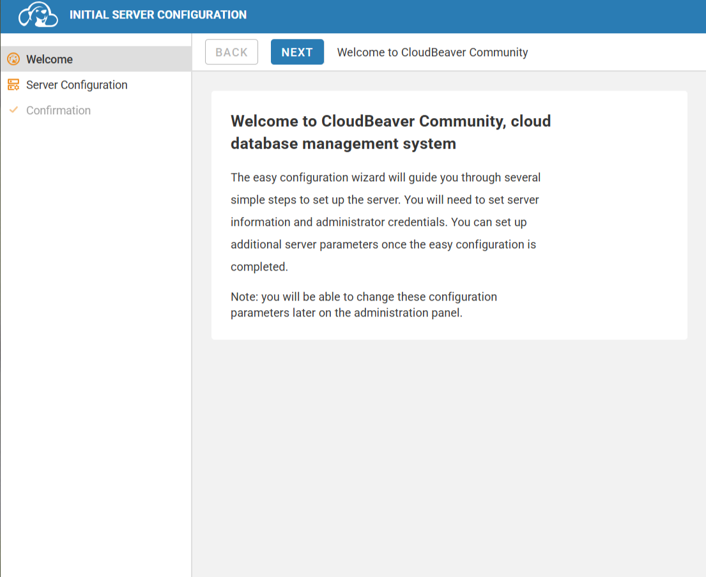
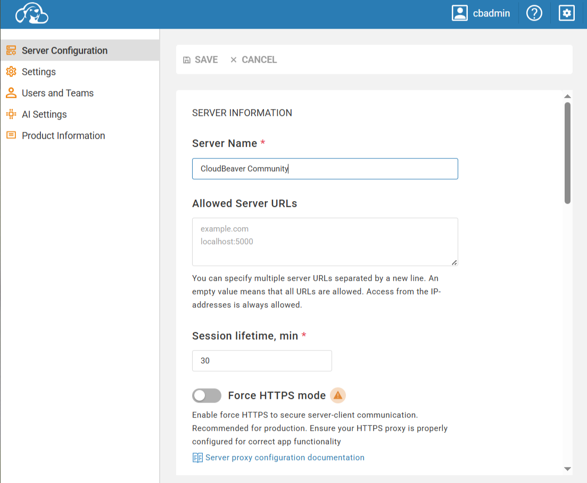
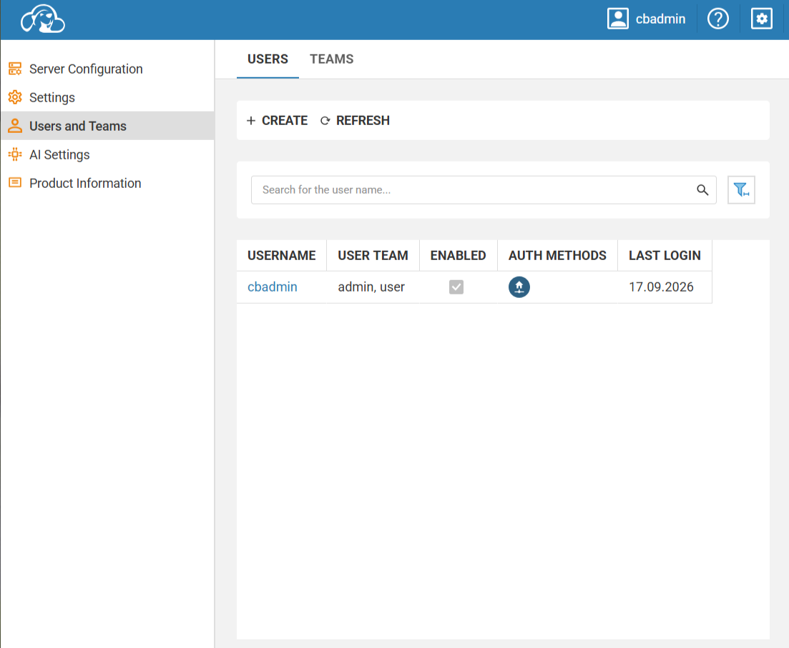

# Задание: Развёртывание CloudBeaver в Docker Compose

## Цель работы

Изучить принципы работы **Docker Compose** на примере развёртывания веб-версии **DBeaver** — **CloudBeaver**. Освоить монтирование рабочего каталога, создание администратора и управление жизненным циклом контейнера.

## Теоретическая справка

**CloudBeaver** — это веб-версия популярного desktop-инструмента **DBeaver**. Позволяет работать с базами данных через браузер, а все подключения и настройки сохраняются в локальном каталоге `workspace`.

**Docker Compose** — инструмент для определения и запуска многоконтейнерных Docker-приложений с помощью файла `compose.yaml`.

## Ход выполнения работы

### 1. Создание каталога проекта

Создайте отдельный каталог для **DBeaver**:

```shell
mkdir DBeaver && cd DBeaver
```

### 2. Создание файла `compose.yaml`

Создайте в каталоге `DBeaver` файл `compose.yaml`:

```yaml
services:
  cloudbeaver:
    image: dbeaver/cloudbeaver:latest
    container_name: cloudbeaver
    restart: unless-stopped
    ports:
      - "8978:8978"
    volumes:
      - ./workspace:/opt/cloudbeaver/workspace
```

Разбор ключевых директив:

| Директива | Назначение |
|-----------|-----------|
| `image: dbeaver/cloudbeaver:latest` | Официальный образ CloudBeaver |
| `container_name: cloudbeaver` | Фиксированное имя контейнера |
| `restart: unless-stopped` | Перезапуск всегда, кроме ручной остановки |
| `ports: "8978:8978"` | Доступ к веб-интерфейсу через `http://localhost:8978` |
| `./workspace:/opt/cloudbeaver/workspace` | Каталог для сохранения подключений и настроек |

### 3. Запуск проекта

Создайте проект (скачать нужные образы, создать контейнеры, запустить сервисы) командой:

```shell
docker compose up -d
```


После этого откройте [http://localhost:8978](http://localhost:8978) и начните работу. Все ваши подключения и настройки сохранятся в папке `./workspace`.



Создайте новый сервер с именем администратора `cbadmin` и своим паролем > 8 символов, включая хотя бы одну прописную и строчную букву.



### 4. Управление проектом

**Состояние проекта как сервиса**

Показать запущенные проекты:

```shell
docker compose ps
```

или все (в т.ч. остановленные):

```shell
docker compose ps -a
```

**Логи**

```shell
docker compose logs cloudbeaver
```

или в режиме ожидания (лучше запускать в отдельном терминале):

```shell
docker compose logs -f cloudbeaver
```

**Остановка, запуск, вход и выход**

Остановить сервис:

```shell
docker compose stop
```

Запустить остановленный сервис:

```shell
docker compose start
```

Перезапустить:

```shell
docker compose restart
```

Показать конфигурацию текущего проекта:

```shell
docker compose config
```

Вход в сервис (имя контейнера можно узнать командой `docker compose ps`):

```shell
docker compose exec mysql bash
```

Выйти из сервиса:

```shell
exit
```

### 5. Удаление проекта

1. Остановка контейнеров этого проекта (нужно находиться в папке проекта):

```shell
docker compose down
```

2. Остановка с полным удалением всех данных (тома, базы данных и файлы) — опционально:

```shell
docker compose down -v
```

**Будьте осторожны:** эта команда удалит всё, что вы создали в проекте!

3. Удалить образ проекта:

```shell
docker image rm dbeaver/cloudbeaver:latest
```

4. Удалить каталог проекта.

Выходим из каталога проекта:

```shell
cd ..
```

и удаляем:

```shell
rm -rf DBeaver
```

Если вы в Linux, то возможно придётся использовать `sudo` или `su -`.

## Полезные ссылки

- [CloudBeaver — официальный сайт](https://dbeaver.com/cloudbeaver/)