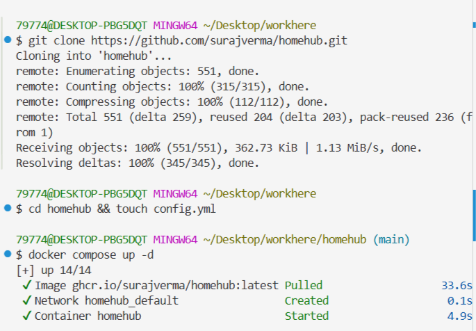
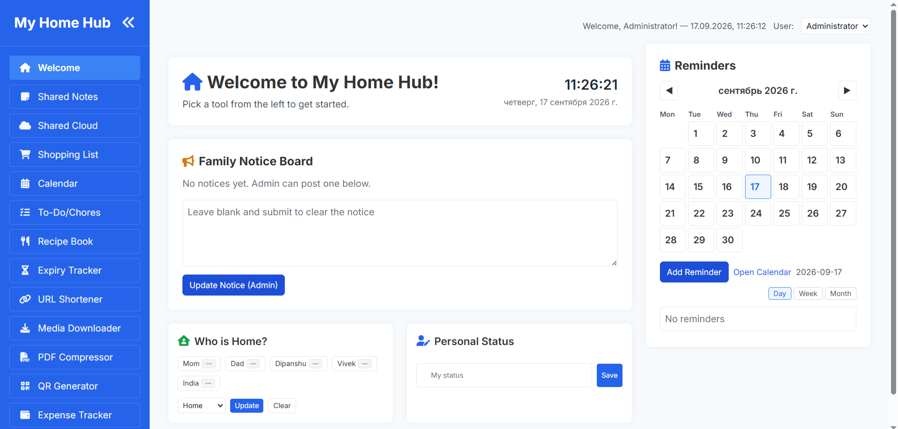

# Задание: Развёртывание HomeHub в Docker Compose

## Цель работы

Изучить принципы работы **Docker Compose** на примере развёртывания семейной панели управления **HomeHub**. Освоить клонирование проекта из upstream-репозитория, монтирование конфигурационных файлов и каталогов, настройку переменных окружения и удаление проекта вместе с образом.

## Теоретическая справка

**HomeHub** — универсальная семейная панель управления. Это лёгкое веб-приложение, которое можно разместить на собственном сервере и которое превращает любой компьютер (даже `Raspberry Pi!`) в центральный узел для общих заметок, списков покупок, домашних дел, загрузки медиафайлов и даже отслеживания семейных расходов.

Ссылка на проект: [HomeHub в GitHub](https://github.com/surajverma/homehub)

**appstream (апстрим)** — автор-разработчик, предоставляющий единую инфраструктуру для описания своего программного обеспечения.

**Docker Compose** — инструмент для определения и запуска многоконтейнерных Docker-приложений с помощью файла `compose.yaml`.

## Ход выполнения работы

### 1. Получение HomeHub из апстрима

Клонируйте репозиторий:

```shell
git clone https://github.com/surajverma/homehub.git
```

Перейдите в локальную папку склонированного репозитория и создайте файл `config.yml`:

```shell
cd homehub && touch config.yml
```

### 2. Файл `compose.yml`

Замените содержимое файла `compose.yml` (файл уже есть в клонированном репозитории):

```yml
# compose.yml
services:
  homehub:
    container_name: homehub
    image: ghcr.io/surajverma/homehub:latest
    ports:
      - "5000:5000" #app listens internally on port 5000
    environment:
      - FLASK_ENV=production
      - SECRET_KEY=${SECRET_KEY:-} # set via .env; falls back to random if not provided
    volumes:
      - ./uploads:/app/uploads
      - ./media:/app/media
      - ./pdfs:/app/pdfs
      - ./data:/app/data
      - ./config.yml:/app/config.yml:ro
```

Разбор ключевых директив:

| Директива | Назначение |
|-----------|-----------|
| `image: ghcr.io/surajverma/homehub:latest` | Образ HomeHub из GitHub Container Registry |
| `container_name: homehub` | Фиксированное имя контейнера |
| `ports: "5000:5000"` | Доступ к веб-интерфейсу через `http://localhost:5000` |
| `FLASK_ENV=production` | Режим работы Flask-приложения |
| `SECRET_KEY=${SECRET_KEY:-}` | Секретный ключ из `.env`; если не задан — генерируется случайно |
| `./uploads:/app/uploads` | Каталог загруженных файлов |
| `./media:/app/media` | Каталог медиафайлов |
| `./pdfs:/app/pdfs` | Каталог PDF-файлов |
| `./data:/app/data` | Каталог данных приложения |
| `./config.yml:/app/config.yml:ro` | Конфигурация, смонтированная только для чтения |

### 3. Файл `config.yml`

Заполните файл `config.yml` следующим содержимым:

```yml
instance_name: "My Home Hub"
password: "" #leave blank for password less access
admin_name: "Administrator"
feature_toggles:
  shopping_list: true
  media_downloader: true
  pdf_compressor: true
  qr_generator: true
  notes: true
  shared_cloud: true
  who_is_home: true
  personal_status: true
  chores: true
  recipes: true
  expiry_tracker: true
  url_shortener: true
  expense_tracker: true

family_members:
  - Mom
  - Dad
  - Dipanshu
  - Vivek
  - India

reminders:
  # time_format controls how reminder times are displayed in the UI.
  # Allowed values: "12h" (default) or "24h". Remove or leave blank to fall back to 12h.
  time_format: 12h

  # calendar_start_day controls which day the reminders calendar starts on.
  # Accepts full weekday names (sunday, saturday).
  calendar_start_day: monday #default is Sunday, comment this line to switch to default

  # Example reminder categories (keys lowercase no spaces recommended)
  categories:
    - key: health
      label: Health
      color: "#dc2626"
    - key: bills
      label: Bills
      color: "#0d9488"
    - key: school
      label: School
      color: "#7c3aed"
    - key: family
      label: Family
      color: "#2563eb"

#Optional settings
theme:
  primary_color: "#1d4ed8"
  secondary_color: "#a0aec0"
  background_color: "#f7fafc"
  card_background_color: "#fff"
  text_color: "#333"
  sidebar_background_color: "#2563eb"
  sidebar_text_color: "#ffffff"
  sidebar_link_color: "rgba(255,255,255,0.95)"
  sidebar_link_border_color: "rgba(255,255,255,0.18)"
  sidebar_active_color: "#3b82f6"
```

### 4. Установка и запуск HomeHub локально

Запустите проект:

```shell
docker compose up -d
```


> **Примечание:** проекту нужно несколько минут для запуска контейнера — подождите немного, прежде чем открыть его в браузере.

Находясь в папке `homehub`, для проверки корректности запуска приложения можно выполнить:

1. Проверить статус:

```shell
docker compose ps
```

2. Показать логи:

```shell
docker compose logs -f
```

`-f` в режиме ожидания (в режиме реального времени).

Чтобы выйти из режима просмотра логов, необходимо выполнить `Ctrl+C` в терминале.

Откройте **HomeHub** локально в браузере: [http://localhost:5000](http://localhost:5000)



### 5. Удалить проект

1. Остановить контейнер с удалением данных:

```shell
docker compose down -v
```

2. Проверить, не запущен ли удаляемый контейнер:

```shell
docker ps -a
```

и

```shell
docker compose ps -a
```

3. Получить id образа:

```shell
docker images
```

4. Удалить образ:

```shell
docker rmi id-образа
```

5. Выйти из каталога:

```shell
cd ..
```

6. Удалить каталог проекта:

```shell
rm -rf homehub
```

**Упрощённый вариант удаления проекта:**

1. Остановить и удалить контейнер с данными:

```shell
docker compose down --rmi all -v
```

2. Выйти из каталога:

```shell
cd ..
```

3. Удалить каталог проекта:

```shell
rm -rf homehub
```