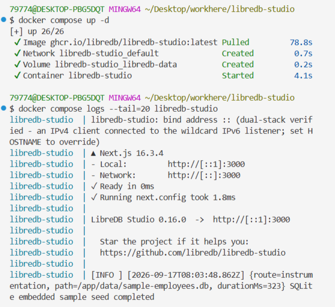
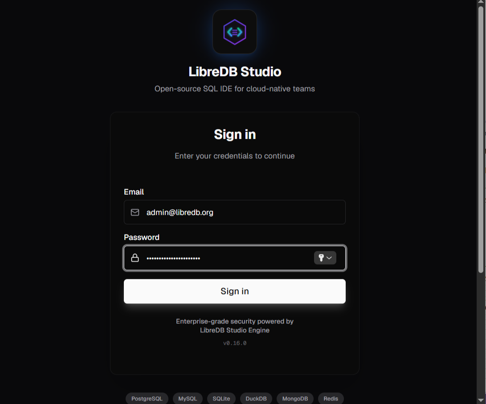
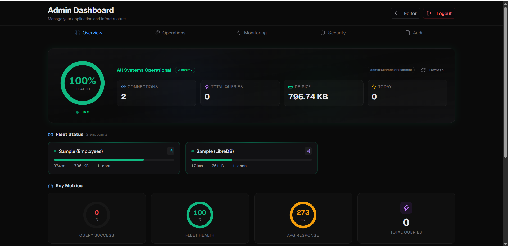

# Задание: Развёртывание LibreDB Studio в Docker Compose

## Цель работы

Изучить принципы работы **Docker Compose** на примере развёртывания веб-IDE **LibreDB Studio** для работы с базами данных. Освоить использование переменных окружения из файла `.env`, настройку `healthcheck`, работу с томами и проверку занятости портов.

## Теоретическая справка

**LibreDB Studio** — это открытая (MIT-лицензия) веб-IDE для работы с базами данных, которая разворачивается как контейнер Docker рядом с самой базой, а не на машине разработчика. По сути, это «браузерный DataGrip/DBeaver» — единая точка входа для запросов, визуализации и администрирования.

Вместо того чтобы каждый разработчик устанавливал десктопное приложение и искал строки подключения, вы разворачиваете один контейнер на сервере (или в облаке) рядом с базой. Пользователи заходят через браузер — включая мобильные устройства, что актуально для «горящих» запросов.

**Docker Compose** — инструмент для определения и запуска многоконтейнерных Docker-приложений с помощью файла `compose.yaml`.

## Ход выполнения работы

### 1. Создание каталога проекта

Перед началом работы проверьте запущенные **docker-compose** приложения:

```shell
docker compose ls
```

Ожидаемая структура проекта:

```
libredb-studio/
└── compose.yaml
```

Создайте структуру проекта одной **bash**-командой:

```shell
mkdir -p libredb-studio && touch libredb-studio/compose.yaml && cd libredb-studio
```

### 2. Содержимое файла конфигурации `compose.yaml`

Заполните файл `compose.yaml` следующим содержимым:

```yml
services:
  libredb-studio:
    image: ghcr.io/libredb/libredb-studio:latest
    container_name: libredb-studio
    ports:
      - "3000:3000"
    environment:
      ADMIN_EMAIL: ${ADMIN_EMAIL:-admin@libredb.org}
      ADMIN_PASSWORD: ${ADMIN_PASSWORD:?set ADMIN_PASSWORD in .env}
      JWT_SECRET: ${JWT_SECRET:?set JWT_SECRET in .env (min 32 chars)}
      STORAGE_PROVIDER: sqlite
      STORAGE_SQLITE_PATH: /app/data/libredb-storage.db
    volumes:
      - libredb-data:/app/data
    restart: unless-stopped
    healthcheck:
      test: ["CMD", "wget", "--spider", "-q", "http://localhost:3000"]
      interval: 30s
      timeout: 10s
      retries: 3
      start_period: 40s

volumes:
  libredb-data:
```

Разбор ключевых директив:

| Директива | Назначение |
|-----------|-----------|
| `image: ghcr.io/libredb/libredb-studio:latest` | Образ LibreDB Studio из GitHub Container Registry |
| `container_name: libredb-studio` | Фиксированное имя контейнера |
| `ports: "3000:3000"` | Доступ к веб-интерфейсу через `http://localhost:3000` |
| `environment:` | Переменные окружения с подстановкой из `.env` |
| `${ADMIN_PASSWORD:?set ...}` | Обязательная переменная: если не задана — Compose выдаст ошибку |
| `volumes: libredb-data` | Том для хранения данных SQLite |
| `healthcheck:` | Автопроверка доступности веб-интерфейса через `wget` |
| `start_period: 40s` | Задержка перед первой проверкой (контейнеру нужно время на старт) |

### 3. Создайте файл `.env`

Создайте файл `.env` в каталоге проекта одной командой:

```shell
cat > .env << 'EOF'
# Обязательные переменные
ADMIN_EMAIL=admin@libredb.org
ADMIN_PASSWORD=YourStrongPassword123!
JWT_SECRET=jirweH6r53yxlN0Ei/IjO4a6lYdi+k9iFrkdzD9BPrk=

# Опционально: обычный пользователь
USER_EMAIL=user@libredb.org
USER_PASSWORD=UserPassword123!
EOF
```

> **Важно:** файл `.env` содержит секреты (пароль администратора и JWT-секрет). Не добавляйте его в систему контроля версий.

### 4. Установка и запуск проекта

Находясь в каталоге проекта `libredb-studio`, выполните проверки перед запуском.

Убедитесь, что порт 3000 свободен:

```shell
ss -tulpn | grep :3000
```

Убедитесь, что контейнер с таким именем не существует:

```shell
docker ps -a | grep libredb-studio
```

Запустите все сервисы проекта:

```shell
docker compose up -d
```



Проверьте статус:

```shell
docker compose ls
```

Посмотрите первые 20 строк логов проекта:

```shell
docker compose logs --tail=20 libredb-studio
```

Проверьте состояние контейнеров:

```shell
docker compose ps -a
```

Просмотр логов в реальном времени:

```shell
docker compose logs -f
```

Чтобы выйти из режима ожидания новых логов, выполните `Ctrl+C`.

Проверьте все логи:

```shell
docker compose logs
```

Перейдите в браузере по адресу [http://localhost:3000](http://localhost:3000).



- логин (email): `admin@libredb.org`
- пароль: `YourStrongPassword123!`



### 5. Удалить проект

1. Остановить и удалить контейнер + том данных:

```shell
docker compose down -v
```

2. Удалить образ:

```shell
docker image rm ghcr.io/libredb/libredb-studio:latest
```

3. Проверить, что ничего не осталось:

```shell
docker ps -a | grep libredb-studio
```

и

```shell
docker volume ls | grep libredb
```

Для надёжности можно дополнительно удалить всё, что могло остаться от прежнего проекта (удаление для состояния «чистого листа» всего Docker):

```shell
docker system prune -a --volumes
```

Удалить папку проекта:

```shell
cd .. ; rm -rf libredb-studio
```

## Полезные ссылки

- [LibreDB Studio — анонс новой версии](https://www.opennet.ru/opennews/art.shtml?num=66216)