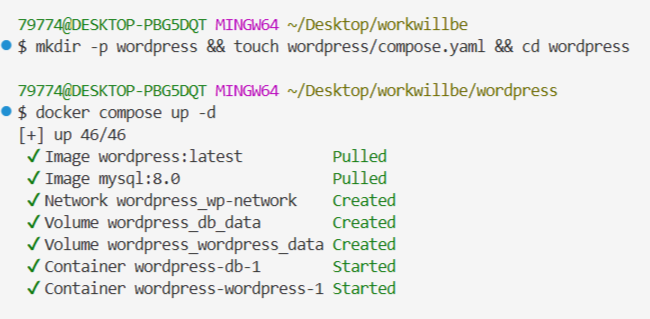
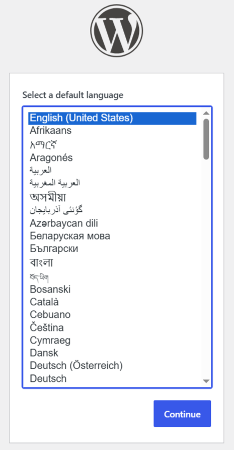
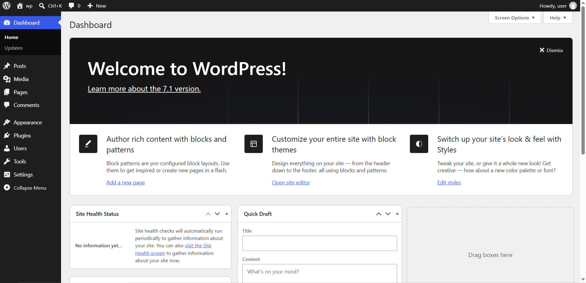
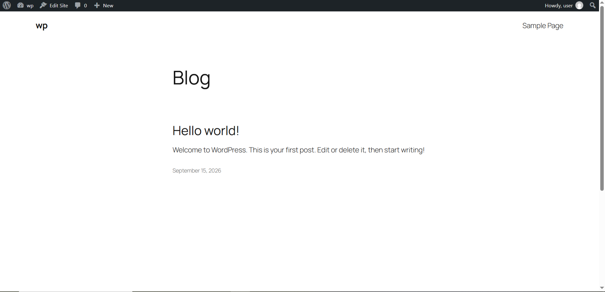
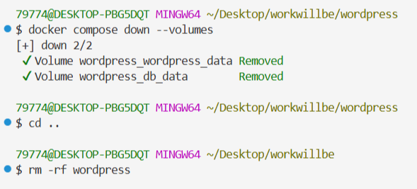

# Задание: Развёртывание WordPress с помощью Docker Compose

## Цель работы

Изучить принципы работы **Docker Compose** на примере развёртывания полноценного веб-приложения **WordPress** с базой данных **MySQL**. Освоить создание многоконтейнерных приложений, работу с томами, сетями и управление жизненным циклом контейнеров.

---

## Теоретическая справка

**WordPress (WP)** — самая популярная в мире система управления контентом (CMS) с открытым исходным кодом, написанная на PHP. Изначально создавалась для блогов, но эволюционировала в универсальную платформу для сайтов любого типа. По данным на 2026 год, WordPress используют около **44 %** всех веб-сайтов в интернете.

**Docker Compose** — инструмент для определения и запуска многоконтейнерных Docker-приложений с помощью файла конфигурации `compose.yaml` (или `docker-compose.yml`).

---

## Ход выполнения работы

### 1. Подготовка рабочего окружения

Перед началом работы проверьте запущенные **docker-compose** приложения:

```shell
docker compose ls
```

> ⚠️ **Важно:** остановите лишние приложения, чтобы избежать конфликтов использования портов.

Создайте структуру проекта одной **bash**-командой:

```shell
mkdir -p wordpress && touch wordpress/compose.yaml && cd wordpress
```

**Ожидаемая структура проекта:**

```
wordpress/
└── compose.yaml
```




---

### 2. Создание файла конфигурации `compose.yaml`

Заполните файл `compose.yaml` следующим содержимым:

```yaml
services:
  # Сервис базы данных
  db:
    image: mysql:8.0
    restart: unless-stopped
    environment:
      MYSQL_ROOT_PASSWORD: somewordpress
      MYSQL_DATABASE: wordpress
      MYSQL_USER: wordpress
      MYSQL_PASSWORD: wordpress
    volumes:
      - db_data:/var/lib/mysql
    networks:
      - wp-network

  # Сервис WordPress
  wordpress:
    depends_on:
      - db
    image: wordpress:latest
    ports:
      - "8081:80"
    restart: unless-stopped
    environment:
      WORDPRESS_DB_HOST: db:3306
      WORDPRESS_DB_USER: wordpress
      WORDPRESS_DB_PASSWORD: wordpress
      WORDPRESS_DB_NAME: wordpress
    volumes:
      - wordpress_data:/var/www/html
    networks:
      - wp-network

networks:
  wp-network:

volumes:
  db_data:
  wordpress_data:
```

**Разбор ключевых директив:**

| Директива | Назначение |
|-----------|-----------|
| `services:` | Определяет два контейнера: `db` (MySQL) и `wordpress` (движок) |
| `depends_on:` | Контейнер `wordpress` запускается после `db` |
| `ports:` | Проброс порта `80` контейнера на порт `8081` хоста |
| `environment:` | Переменные окружения для настройки БД и подключения к ней |
| `volumes:` | Тома `db_data` и `wordpress_data` сохраняют данные независимо от контейнеров |

---

### 3. Запуск проекта

В папке с файлом `compose.yaml` выполните:

```shell
docker compose up -d
```

Параметр `-d` означает **фоновый режим** запуска контейнеров. Docker начнёт скачивать образы и запускать контейнеры — это может занять несколько минут.

Проверьте статус контейнеров:

```shell
docker compose ps -a
```

✅ Оба контейнера (`wordpress` и `db`) должны иметь статус **Up**.

---

### 4. Установка WordPress через браузер

Откройте в браузере адрес:

🔗 [http://localhost:8081](http://localhost:8081)

Укажите системе **WP** логин (например, `user`), сохраните предложенный пароль, выполните установку и войдите в админ-панель. Из админ-панели откройте сайт.







---

### 5. Управление проектом

Находясь в папке `wordpress`, изучите полезные команды:

| Команда | Описание |
|---------|----------|
| `docker compose logs -f wordpress` | Логи WordPress в реальном времени (`Ctrl+C` — выход) |
| `docker compose logs -f db` | Логи базы данных в реальном времени (`Ctrl+C` — выход) |
| `docker compose stop` | Приостановить контейнеры |
| `docker compose start` | Запустить приостановленные контейнеры |
| `docker compose restart` | Перезапустить контейнеры |
| `docker compose config` | Показать текущую конфигурацию проекта |

---

### 6. Удаление проекта

Для остановки контейнеров проекта:

```shell
docker compose down
```

Для полного удаления всех данных (базы данных и файлов):

```shell
docker compose down --volumes
```



или кратко:

```shell
docker compose down -v
```

> ⚠️ **Будьте осторожны:** команда удалит всё, что вы создали на сайте WordPress!

Для полного удаления проекта выйдите из каталога и удалите его:

```shell
cd ..
rm -rf wordpress
```
